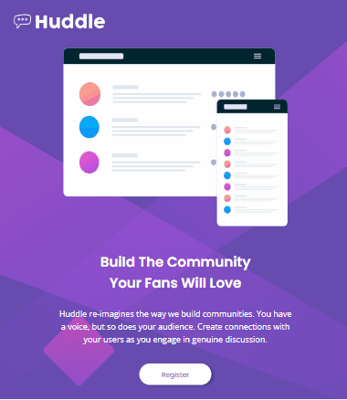

# Projeto Landing Page Handdle

Projeto de um layout que contem na pagina do site, o logo da pagina, imagem lateral, um titulo, uma descrição, um botão de registro, e um rodapé, com contatos da pagina com link do fo facebook, a rede social X antigo twitter e o instagram, utilizando display flex e grid.

Como podemor ver no exemplo:

### Modelo em um laptop:

### Modelo em um tablet:

### Modelo em um celular:

## Redes:

- <a href='https://github.com/LucasVilela1410' target="_blank">GitHub</a>
- <a href='https://www.linkedin.com/in/lucas-vilela-59710624a/' target="_blank">Linkedin</a>